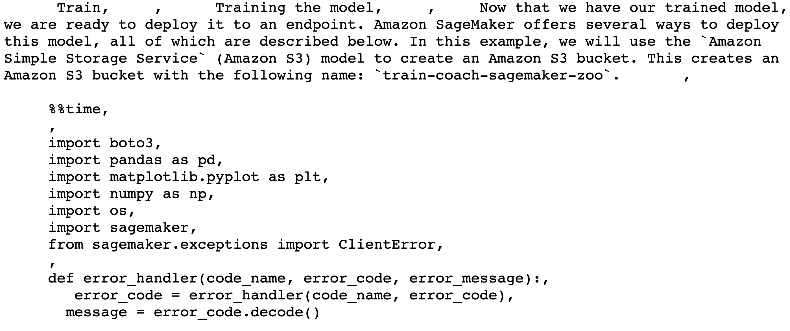
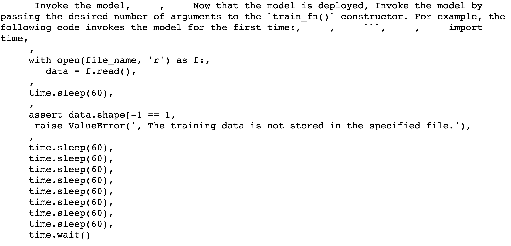

# Fine Tune GPT on SageMaker Examples
In this example, we thought it'd be fun to fine-tune the natural language generator, GPT2, on some code! So we downloaded the SageMaker Examples repo, processed it into a large text file, and passed this into a downloaded GPT2 model. All of this runs on a substantial SageMaker GPU, ml.p3.24xlarge, using script mode.

The notebook is the starting point, that will help you clone the repo, employ a `utils.py` package to transform the `.ipynb` files, and package that up inside of script mode with the GPT2 model. 

Feel free to step through this yourself, or modify to leverage your own base text. 

Here's an example of what we generated from the fine-tuned GPT. You can see the model starts with a logical overview, explaining that given our trained model we will deploy it to an endpoint, and even calling out that SageMaker offers a variety of ways to do this! The model learned about S3, and then writes its own code snippet including imports, an error handler, more exposition, a read from a file, and a sleeper!

Here is the second snippet - again, all of this generated by the fine tuned GPT model!

