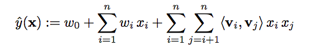
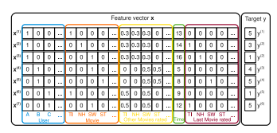

# Movie Recommendation Engines

*Business Case*
Movies are well loved by much of the world's population! Today you have joined the ranks of Netflix's data science team; your mission is to recommend the best movie to each customer.

*Machine Learning Method*
In this project, you will learn about Factorization Machines. This is a highly scalable algorithm that was developed by Steffen Rendel in 2010. It has the capacity to leverage extremely large datasets at the Terabyte scale, while still training in linear time. 

 

In essence, the factorization machines model is calculating the dot product between the user information and the item information, then computing the difference between those to update the model.

 

In order to accomplish this, you'll need to *format your data as events*. Each row in your final data set will need to be a single point in time when a customer interacts with a product account. Each column will be either a binary indicator for the product/user, or another feature.

*Data set description*
We highly suggest using the Movie Lens dataset. This is well suited to recommendation problems and should be available from public sources.

*A follow up note on method*

* The built-in algorithm you are working with is designed to only handle either binary classification or regression. It can be extended to provide multi-class classification with KNN. First start with the recommender, and if your are up to the task, consider extracting the matrix and using it to build KNN clusters.

*Starter Code*
- https://github.com/aws-samples/amazon-sagemaker-architecting-for-ml/blob/master/Starter-Code/Recommendation-System-FM-KNN.ipynb

*Extension*
After you've run through a few steps, try extending your solution by using the managed recommendation service from AWS, Personalize. 
- https://github.com/aws-samples/amazon-personalize-samples 

*References*

* In Python: https://www.datacamp.com/community/tutorials/recommender-systems-python
* Intuitively: https://www.analyticsvidhya.com/blog/2018/01/factorization-machines/ 
* Formally: https://www.csie.ntu.edu.tw/~b97053/paper/Rendle2010FM.pdf 

