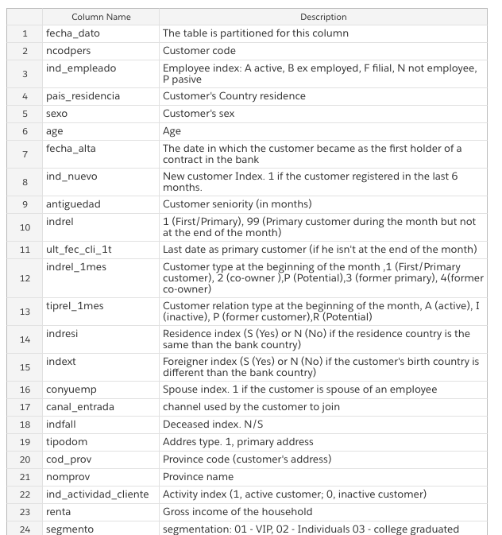
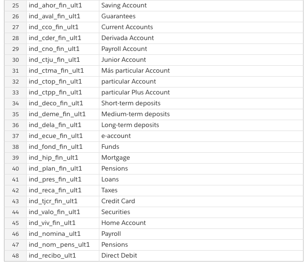

# Product Recommendation Engines

*Business Case*
Financial firms offer a wide array of products: checking accounts and retirement plans are just the beginning. Today, you have joined the ranks of the data scientists at Santander.  Your current website provides a large number of recommendations to a small number of customers, which means that your company is not taking full advantage of the data sets your currently own and maintain. If you could recommend the right product to the right customer, you could accelerate your growth and meet the real demands of your consumer base.

*Machine Learning Method*
In this project, you will learn about Factorization Machines. This is a highly scalable algorithm that was developed by Steffen Rendel in 2010. It has the capacity to leverage extremely large datasets at the Terabyte scale, while still training in linear time. 

 

In essence, the factorization machines model is calculating the dot product between the user information and the item information, then computing the difference between those to update the model.

 

In order to accomplish this, you'll need to *format your data as events*. Each row in your final data set will need to be a single point in time when a customer interacts with a product account. Each column will be either a binary indicator for the product/user, or another feature.

*Data set description*
At your disposal, you have 1.5 years of consumer behavior. Your data begins in January 2015, and includes monthly records of customer activity. This includes credit card ownerships, savings account utilization etc. 

 
 

https://www.kaggle.com/c/santander-product-recommendation/data 

Your goal is to prediction additional products a customer will purchase in the final month, June 2016, given what they already have in the previous month. These products are the columns named: ind_(xyz)_ult1, which are the columns #25 - #48 in the training data. 

The test and train sets are split by time.

*Starter Notebook*

* Architecting-For-ML/StarterCode/Santander

*A follow up note on method*

* The built-in algorithm you are working with is designed to only handle either binary classification or regression. Consequentially, your first task will be to follow the starter code notebook and modify your data to fill a regression function. That is, you'll be generating a regression to find your outcome variable, rather than using a multi-class classifier. The outcome from your regression model will fall into a discrete category that corresponds to the product they are purchasing. This method may or may not prove fruitful; you'll need to design an experiment strategy that evaluates this.

*References*

* In Python: https://www.datacamp.com/community/tutorials/recommender-systems-python
* Intuitively: https://www.analyticsvidhya.com/blog/2018/01/factorization-machines/ 
* Formally: https://www.csie.ntu.edu.tw/~b97053/paper/Rendle2010FM.pdf 

